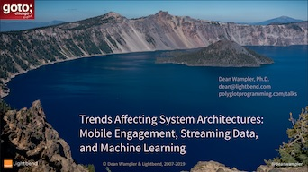



<section id="talks" class="talks centered">
Most of my conference and user group talks can be found in this <a href="https://github.com/deanwampler/Presentations/">GitHub repo</a>. I recent removed some very old talks from the list on this page.

<table class="talks-table centered">
  <tr>
    <td>
      <a id="modularity-a-retrospective"/>
      <article class="talk">
        <h1>Modularity: A Retrospective</h1>
        
GOTO Chicago Nights, February 18, 2020

        
A look at what we've accomplished in making software modular and
        where we need to go.

        

          <a href="/polyglotprogramming/papers/Modularity-a-Retrospective.pdf" class="button button-pdf">Download PDF</a>
        

      </article>
    </td>
    <td>
      
    </td>
  </tr>

  <tr>
    <td>
      <a id="trends-affecting-system-architectures"/>
      <article class="talk">
        <h1>Trends Affecting System Architectures</h1>
        
GOTO Chicago Nights, April 2, 2019

        
A look at how the increasing importance of handling data quickly is driving applications towards streaming. In particular, the challenges of leveraging machine learning and AI in these streaming applications.

        

          <a href="/polyglotprogramming/papers/TrendsAffectingSystemArchitectures.pdf" class="button button-pdf">Download PDF</a>
        

      </article>
    </td>
    <td>
      
    </td>
  </tr>

  <tr>
    <td>
      <a id="executive-briefing-what-it-takes-to-use-ml-in-fast-data-pipelines"/>
      <article class="talk">
        <h1>Executive Briefing: What It Takes to Use ML in Fast Data Pipelines</h1>
        
Strata San Francisco, London, and NYC 2019

        
A briefing for managers and executives about the challenges of serving ML models in a streaming data context.

        

          <a href="/polyglotprogramming/papers/ExecutiveBriefing-WhatItTakesToUseMLinFastDataPipelines.pdf" class="button button-pdf">Download PDF</a>
        

      </article>
    </td>
    <td>
      
    </td>
  </tr>

  <tr>
    <td>
      <a id="executive-briefing-what-you-need-to-know-about-fast-data"/>
      <article class="talk">
        <h1>Executive Briefing: What You Need to Know about Fast Data</h1>
        
Strata London and NYC 2018

        
A briefing for managers and executives about the trends in Fast Data and how the impact on their organizations.

        

          <a href="/polyglotprogramming/papers/ExecutiveBriefing-WhatYouNeedToKnowAboutFastData.pdf" class="button button-pdf">Download PDF</a>
          <a href="https://info.lightbend.com/webinar-fast-data-executive-briefing-recording.html" class="button button-video">Watch video</a> (A similar webinar)
        

      </article>
    </td>
    <td>
      
    </td>
  </tr>

  <tr>
    <td>
      <a id="streaming-microservices-with-akka-streams-and-kafka-streams"/>
      <article class="talk">
        <h1>Streaming Microservices with Akka Streams and Kafka Streams</h1>
        
Strata San Jose and London 2018, Scala Days NYC 2018, Reactive Summit 2018, YOW! 2018

        
I discuss processing data in microservices using Akka Streams and Kafka Streams, vs. using tools like Spark and Flink.

        

          <a href="/polyglotprogramming/papers/KafkaMicroservices-AkkaStreams-KafkaStreams.pdf" class="button button-pdf">Download PDF</a>
          <a href="https://www.youtube.com/watch?time_continue=1&v=X3FjsYz2occ" class="button button-video">Watch video</a>
        

      </article>
    </td>
    <td>
      
    </td>
  </tr>

  <tr>
    <td>
      <a id="stream-all-the-things"/>
      <article class="talk">
        <h1>Stream All the Things!!</h1>
        
Software Architecture Conference NYC 2017, Strata London and NYC 2017, Reactive Summit 2017, ScalaIO 2017, YOW! Data 2018

        
I discuss the emerging architecture for large-scale stream data processing, that also integrates the best of microservice architectures.

        

          <a href="/polyglotprogramming/papers/StreamAllTheThings.pdf" class="button button-pdf">Download PDF</a>
          <a href="https://www.youtube.com/watch?v=T-RHhxptrlw&feature=youtu.be" class="button button-video">Watch video</a>
        

      </article>
    </td>
    <td>
      
    </td>
  </tr>

  <tr>
    <td>
      <a id="bash-and-all-that"/>
      <article class="talk">
        <h1>Bash and All That</h1>
        
GOTO Chicago 2018

        
A celebration of the UNIX philosophy and the tools it spawned.

        

          <a href="BashAndAllThat.pdf" class="button button-pdf">Download PDF</a>
        

      </article>
    </td>
    <td>
      
    </td>
  </tr>

  <tr>
    <td>
      <a id="scala-and-the-jvm-for-big-data-lessons-from-spark"/>
      <article class="talk">
        <h1>Scala and the JVM for Big Data: Lessons from Spark</h1>
        
Strata San Jose and Singapore 2016

        
The JVM is the standard platform for Big Data and Scala is emerging as the standard programming language for Big Data Developers, driven in part by <a href="https://spark.apache.org">Spark</a>. What lessons can we draw from this picture?

        

          <a href="ScalaJVMBigData-SparkLessons.pdf" class="button button-pdf">Download PDF</a>
          <a href="ScalaJVMBigData-SparkLessons-extended.pdf" class="button button-pdf">Longer Version</a>
          <a href="https://www.youtube.com/watch?v=FC-7AAZggl8" class="button button-video">Watch video</a>
        

      </article>
    </td>
    <td>
      
    </td>
  </tr>

  <tr>
    <td>
      <a id="why-spark-is-the-next-top-compute-model"/>
      <article class="talk">
        <h1>Why Spark Is The Next Top (Compute) Model</h1>
        
Numerous Venues 2014 and 2015

        
<a href="https://spark.apache.org">Spark</a> has emerged as the replacement for <em>MapReduce</em> in <em>Hadoop</em> applications. This talk explains why.

        

          <a href="Spark-TheNextTopComputeModel.pdf" class="button button-pdf">Download PDF</a>
          <a href="https://www.youtube.com/watch?v=R0kCmkUDdKs" class="button button-video">Watch video</a>
       

      </article>
    </td>
    <td>
      
    </td>
  </tr>

  <tr>
    <td>
      <a id="data-science-at-scale-with-spark"/>
      <article class="talk">
        <h1>Data Science at Scale with Spark</h1>
        
GOTO Chicago 2015

        
Using examples, I show how to use <a href="https://spark.apache.org">Spark</a> for Data Science at scale in ways that were previously not feasible with other tools.

        

          <a href="DataScienceAtScaleWithSpark.pdf" class="button button-pdf">Download PDF</a>
        

      </article>
    </td>
    <td>
      
    </td>
  </tr>

  <tr>
    <td>
      <a id="the-unreasonable-effectiveness-of-scala-for-big-data"/>
      <article class="talk">
        <h1>The Unreasonable Effectiveness of Scala for Big Data</h1>
        
<a href="https://event.scaladays.org/scaladays-sanfran-2015#!#schedulePopupExtras-6536">Scala Days 2015</a>.

        
Why <em>Scala</em> has proven so effective as the general-purpose programming language for Big Data development.

        

          <a href="UnreasonableEffectivenessOfScalaForBigData.pdf" class="button button-pdf">Download PDF</a>
          <a href="https://www.parleys.com/tutorial/the-unreasonable-effectiveness-scala-big-data" class="button button-video">Video</a>
        

      </article>
    </td>
    <td>
      
    </td>
  </tr>

  <tr>
    <td>
      <a id="why-scala-is-taking-over-the-big-data-world"/>
      <article class="talk">
        <h1>Why Scala Is Taking Over the Big Data World</h1>
        
<a href="https://www.scaladays.org/#schedule/Why-Scala-is-Taking-Over-the-Big-Data-World">Scala Days 2014</a>, <a href="https://skillsmatter.com/conferences/1948-scala-exchange-2014">Scala eXchange 2014</a>, and <a href="https://datadaytexas.com/">Data Day Texas 2015</a>

        
<em>Scala</em> has emerged as the <em>de facto</em> language for big data development, driven in part by tools like <a href="https://github.com/twitter/scalding">Scalding</a> and <a href="https://spark.apache.org">Spark</a>.

        

          <a href="WhyScalaIsTakingOverTheBigDataWorld.pdf" class="button button-pdf">Download PDF</a>
          <a href="https://skillsmatter.com/skillscasts/5423-why-scala-is-taking-over-the-big-data-world" class="button button-video">Watch video</a> (Scala eXchange)
        

      </article>
    </td>
    <td>
      
    </td>
  </tr>

  <tr>
    <td>
      <a id="the-internet-was-made-for-cats"/>
      <article class="talk">
        <h1>The Internet Was Made for Cats</h1>
        
<a href="https://www.meetup.com/chicagoscala/events/226860360/">Chicago Scala Users Group, Jan 2016</a>

        
My informal introduction to the <a href="https://github.com/non/cats">Typelevel Cats</a> project, including why I think it's model for open-source development.

        

          <a href="Cats.pdf" class="button button-pdf">Download PDF</a>
        

      </article>
    </td>
    <td>
      
    </td>
  </tr>

  <tr>
    <td>
      <a id="copious-data-the-killer-app-for-functional-programming"/>
      <article class="talk">
        <h1>Copious Data, the Killer App for Functional Programming</h1>
        
<a href="https://lambdajam.com/">LambdaJam Chicago</a>

        
I argue that <em>"Copious" Data</em> (okay, <em>Big Data</em>) is driving adoption of <em>Functional Programming</em> (FP), more so than multicore concurrency concerns, because more developers will grapple with data problems than concurrency. Because FP is based on Mathematics, it is a natural fit for working with Data, whereas languages like Java, in which Hadoop is written, are poor choices. (November 21, 2013)

        

          <a href="CopiousData_TheKillerAppForFP.pdf" class="button button-pdf">Download PDF</a>
          <a href="https://www.infoq.com/presentations/big-data-functional-programming" class="button button-video">Watch video</a> (earlier version)
        

      </article>
    </td>
    <td>
      
    </td>
  </tr>

  <tr>
    <td>
      <a id="sql-strikes-back-recent-trends-in-data-persistence-and-analysis"/>
      <article class="talk">
        <h1>SQL Strikes Back! Recent Trends in Data Persistence and Analysis</h1>
        
<a href="https://codemesh.io">CodeMesh London 2014</a>

        
Relational databases fell out of fashion with the rise of <em>NoSQL</em> and <em>Hadoop</em>. But SQL proved too useful for too many people, so there are now many SQL-based query tools for Hadoop and subsets of SQL on several "NoSQL" databases. This talk discusses this trend and why it started. (November 4th, 2014)

        

          <a href="SQLStrikesBack.pdf" class="button button-pdf">Download PDF</a>
        

      </article>
    </td>
    <td>
      
    </td>
  </tr>

  <tr>
    <td>
      <a id="the-seductions-of-scala"/>
      <article class="talk">
        <h1>The Seductions of Scala</h1>
        
Various Venues

        
An introduction to Scala that I often give at conferences and user groups. The PDF includes a lot of extra material that won't fit into a 50-60 minute time slot. The GitHub <a href="https://github.com/deanwampler/Presentations/tree/master/SeductionsOfScala">page</a> for this talk also has the sources used for the examples. In particular, for the <a href="https://akka.io">Akka-based</a> Actor example at the end of the talk, see <a href="https://github.com/deanwampler/Presentations/blob/master/SeductionsOfScala/code-examples/actors/README.md">README.md</a>. (November 19, 2013)

        

          <a href="SeductionsOfScala.pdf" class="button button-pdf">Download PDF</a>
          <!-- <a href="#" class="button button-video">Watch video</a> -->
        

      </article>
    </td>
    <td>
      
    </td>
  </tr>

  <tr>
    <td>
      <a id="mapreduce-and-its-discontents"/>
      <article class="talk">
        <h1>MapReduce and Its Discontents</h1>
        
QCon NYC 2012, and <a href="https://www.bigdatatechcon.com/boston2013/">Big Data Techcon Boston 2013</a>

        
My first public talk where I claimed that <em>MapReduce is the Enterprise JavaBeans of our time</em>. I criticized the <em>MapReduce</em> programming model and the technical limitations of the <em>Hadoop</em> implementation, in particular. In part, I argued that Java (pre Java-8 especially) is the wrong tool for developing <em>Big Data</em> applications and middleware. Instead, we should be using <em>Functional Programming</em>, since when we work with data, we are really doing <em>Mathematics</em>! (April 11, 2013)

        

          <a href="MapReduceAndItsDiscontents.pdf" class="button button-pdf">Download PDF</a>
        

      </article>
    </td>
    <td>
      
    </td>
  </tr>

  <tr>
    <td>
      <a id="why-big-data-needs-to-be-functional"/>
      <article class="talk">
        <h1>Why Big Data Needs to Be Functional</h1>
        
NE Scala Symposium 2011

        
A more general version of the previous "Discontents" talk, where I argue that the <em>Hadoop</em> community needs to drop reliance on Java-centric, Object-Oriented approaches and embrace Functional Programming and languages like Scala. (April 15th, 2012)

        

          <a href="WhyBigDataNeedsToBeFunctional-print.pdf" class="button button-pdf">Download PDF</a>
          <a href="https://nescala.org/#t-8958946" class="button button-video">Watch video</a>
        

      </article>
    </td>
    <td>
      
    </td>
  </tr>

  <tr>
    <td>
      <a id="heresies-and-dogmas-in-software-development"/>
      <article class="talk">
        <h1>Heresies and Dogmas in Software Development</h1>
        
<a href="https://thestrangeloop.com">Strange Loop 2011</a>

        
I look at 5 ideas in the history of software development that were once popular, and still are in some quarters, but are now seen by most people as obsolete. (November 9th, 2011)

        

          <a href="HeresiesAndDogmasInSoftwareDevelopment.pdf" class="button button-pdf">Download PDF</a>
          <a href="https://www.infoq.com/presentations/Heresies-and-Dogmas-in-Software-Development" class="button button-video">Watch video</a>
        

      </article>
    </td>
    <td>
      
    </td>
  </tr>

  <tr>
    <td>
      <a id="better-programming-through-functional-programming"/>
      <article class="talk">
        <h1>Better Programming Through Functional Programming</h1>
        

        
A half-day tutorial that introduces <em>Functional Programming</em>, why it has become important for our time, and how you can apply its ideas in almost any language. Examples are given in Java and Ruby. There is also a <a href="HowFPChangesDevPractices.pdf">shorter talk</a> version. (July 31st, 2011)

        

          <a href="BetterProgrammingThroughFP.pdf" class="button button-pdf">Download PDF</a>
          <a href="HowFPChangesDevPractices.pdf" class="button button-pdf">Download Shorter Talk</a>
        

      </article>
    </td>
    <td>
      
    </td>
  </tr>

  <tr>
    <td>
      <a id="polyglot-and-poly-paradigm-programming"/>
      <article class="talk">
        <h1>Polyglot and Poly-paradigm Programming</h1>
        
QCon San Francicso 2008

        
An argument that modern development problems benefit from a <i>multi-paradigm</i> and/or <i>multi-language</i> solution strategy. Different strategies are discussed in the contexts of example problems (April 2, 2011)

        

          <a href="PolyglotPolyParadigm.pdf" class="button button-pdf">Download PDF</a>
          <a href="https://www.infoq.com/presentations/polyglot-polyparadigm-programming" class="button button-video">Watch video</a> (Early version of this talk)
        

      </article>
    </td>
    <td>
      
    </td>
  </tr>

  <tr>
    <td>
      <a id="hive-sql-for-hadoop"/>
      <article class="talk">
        <h1>Hive - SQL for Hadoop</h1>
        
Chicago Hadoop Users Group

        
This talk introduces <em>Hive</em>, the original SQL tool for <em>Hadoop</em> and explains why it's a key technology that drove adoption of the ecosystem, primarily because it makes it easier to transition SQL-based data warehouses to <em>Hadoop</em> and it enables conventional data analysts to work with <em>Hadoop</em>. (January 2012)

        

          <a href="Hive-SQLforHadoop.pdf" class="button button-pdf">Download PDF</a>
        

      </article>
    </td>
    <td>
      
    </td>
  </tr>

</table>
</section>

<h2>Other Presentations</h2>

In addition to the talks above, here are a few others.

<h3>Akka</h3>

    <ul>
        <li><a href="https://github.com/deanwampler/Presentations/tree/master/akka-intro/">The Akka Framework</a>: An overview of the <a href="https://akka.io">Akka Framework</a> for building robust, highly concurrent servers in Java or Scala.</li>
    </ul>

<h3>Reactive Programming</h3>

The <a href="https://reactivemanifesto.org">Reactive Manifesto</a> lays out a vision for Reactive Programming. These talks explore various aspects of Reactive.

    <ul>
        <li><a href="ReactiveSystems-TheWhyAndTheHow.pdf">Reactive Systems - The Why and the What</a>  and <a href="https://www.safaribooksonline.com/library/view/oreilly-software-architecture/9781491924563/video211449.html">Video</a>.</li>
        <li><a href="ReactiveDesignLanguagesAndParadigms.pdf">Reactive Design, Languages and Paradigms</a>  and <a href="https://www.youtube.com/watch?v=4L3cYhfSUZs&feature=youtu.be">Video</a>.</li>
        <li><a href="ErrorHandlingReactiveSystems.pdf">Error Handling in Reactive Systems</a> .</li>
    </ul>

<h3>Aquarium</h3>

    <ul>
        <li><a href="Aquarium_RubyAOP.pdf">Aquarium: Aspect-Oriented Programming for Ruby</a> . There are a few exercises that go with the talk: <a href="Aquarium_RubyAOP_exercises.zip">Aquarium_RubyAOP_exercises.zip</a></li>
        <li><a href="Aquarium_AOP_for_Ruby_presentation.pdf">Aquarium: AOP for Ruby</a> . A 30-minute talk presented at <a href="https://aosd.net/2008/">Aspect-Oriented Software Development 2008</a>. The talk was based on my <a href="https://www.aosd.net/2008/program/industry.php">Industry Track paper</a>.</li>
    </ul>

<a id="general-aosd"/>
<h3>General AOSD</h3>

    <ul>
        <li><a href="AOPerspectiveOnOOD.pdf">Noninvasiveness and Aspect-Oriented Design: Lessons from Object-Oriented Design Principles</a>. Research Paper discussing classic OO design principles in the context of AOSD.</li>
        <li><a href="AOP_Academia_and_Industry.pdf">AOP in Academia and Industry</a> .</li>
        <li><a href="https://aosd.net/2007/program/industry/I6-AspectDesignPrinciples.pdf">Aspect-Oriented Design Principles: Lessons from Object-Oriented Design</a> (.</li>
        <li><a href="https://www-128.ibm.com/developerworks/java/library/j-aopwork17.html">AOP@Work: Component Design with Contract4J</a> (IBM <a href="https://www-128.ibm.com/developerworks">developerWorks</a>).</li>
        <li><a href="TheChallengesOfWritingReusableAspectsInAspectJ.pdf">The Challenges of Writing Reusable and Portable Aspects in AspectJ: Lessons from Contract4J</a> .</li>
        <li><a href="https://www.aosd.net/workshops/acp4is/2006/papers/7.pdf">Contract4J for Design by Contract in Java: Design Pattern-Like Protocols and Aspect Interfaces</a> </li>
        <li><a href="TheFutureOfAOP.pdf">The Future of AOP</a> </li>
    </ul>

