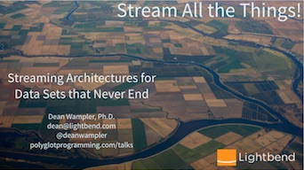
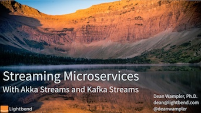
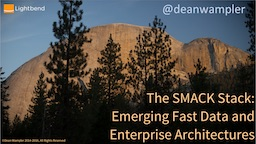
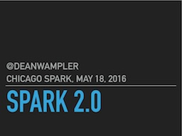
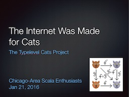



<section id="talks" class="talks centered">
Most of my conference and user group talks can be found in this GitHub <a href="http://github.com/deanwampler/Presentations/">repo</a>.

<table class="talks-table centered">
  <tr>
    <td>
      <article class="talk">
        <h1>Stream All the Things!!</h1>
        
2017: Software Architecture Conference NYC, Strata London, Strata NYC, Reactive Summit, ScalaIO. 2018: YOW! Data

        
I discuss the emerging architecture for large-scale stream data processing, that also integrates the best of microservice architectures.

        

          <a href="/polyglotprogramming/papers/StreamAllTheThings.pdf" class="button button-pdf">Download PDF</a>
          <a href="https://www.youtube.com/watch?v=T-RHhxptrlw&feature=youtu.be" class="button button-video">Watch video</a>
        

      </article>
    </td>
    <td>
      
    </td>
  </tr>

  <tr>
    <td>
      <article class="talk">
        <h1>Streaming Microservices with Akka Streams and Kafka Streams</h1>
        
Strata San Jose and Strata London, 2018

        
I discuss processing data in microservices using Akka Streams and Kafka Streams, vs. using tools like Spark and Flink.

        

          <a href="/polyglotprogramming/papers/KafkaMicroservices-AkkaStreams-KafkaStreams.pdf" class="button button-pdf">Download PDF</a>
        

      </article>
    </td>
    <td>
      
    </td>
  </tr>

  <tr>
    <td>
      <article class="talk">
        <h1>Bash and All That</h1>
        
GOTO Chicago, 2018

        
A celebration of the UNIX philosophy and the tools it spawned.

        

          <a href="BashAndAllThat.pdf" class="button button-pdf">Download PDF</a>
        

      </article>
    </td>
    <td>
      
    </td>
  </tr>

  <tr>
    <td>
      <article class="talk">
        <h1>Scala and the JVM for Big Data: Lessons from Spark</h1>
        
Strata + Hadoop World, San Jose and Singapore, 2016

        
The JVM is the standard platform for Big Data and Scala is emerging as the standard programming language for Big Data Developers, driven in part by <a href="http://spark.apache.org">Spark</a>. What lessons can we draw from this picture?

        

          <a href="ScalaJVMBigData-SparkLessons.pdf" class="button button-pdf">Download PDF</a>
          <a href="ScalaJVMBigData-SparkLessons-extended.pdf" class="button button-pdf">Longer Version</a>
          <a href="https://www.youtube.com/watch?v=FC-7AAZggl8" class="button button-video">Watch video</a>
        

      </article>
    </td>
    <td>
      
    </td>
  </tr>

  <tr>
    <td>
      <article class="talk">
        <h1>The SMACK Stack: Emerging Fast Data and Microservice Architectures</h1>
        
CodeNode London, October 24, 2016

        
<a href="http://spark.apache.org">Spark</a>, <a href="http://mesos.apache.org">Mesos</a>, <a href="http://akka.io">Akka</a>, <a href="http://cassandra.apache.org">Cassandra</a>, and <a href="http://kafka.apache.org">Kafka</a> form the basis for new, flexible architectures for Fast Data and Microservice applications. This talk describes the characteristics these applications need and how the SMACK combination meets those needs.

        

          <a href="SMACKStack.pdf" class="button button-pdf">Download PDF</a>
        

      </article>
    </td>
    <td>
      <a href="SMACKStack.pdf">Download PDF</a>
    </td>
  </tr>

  <tr>
    <td>
      <article class="talk">
        <h1>Spark 2.0</h1>
        
Chicago Spark Meetup, May 18, 2016

        
<a href="http://spark.apache.org">Spark</a> 2.0 introduces significant improvements and refactorings. This talk summarizes the major changes.

        

          <a href="Spark20.pdf" class="button button-pdf">Download PDF</a>
        

      </article>
    </td>
    <td>
      
    </td>
  </tr>

  <tr>
    <td>
      <article class="talk">
        <h1>Why Spark Is The Next Top (Compute) Model</h1>
        
Numerous Venues - 2014, 2015

        
<a href="http://spark.apache.org">Spark</a> has emerged as the replacement for <em>MapReduce</em> in <em>Hadoop</em> applications. This talk explains why.

        

          <a href="Spark-TheNextTopComputeModel.pdf" class="button button-pdf">Download PDF</a>
          <a href="https://www.youtube.com/watch?v=R0kCmkUDdKs" class="button button-video">Watch video</a>
       

      </article>
    </td>
    <td>
      
    </td>
  </tr>

  <tr>
    <td>
      <article class="talk">
        <h1>Spark on Mesos</h1>
        
Strata + Hadoop World London and NYC 2015

        
While <a href="http://spark.apache.org">Spark</a> is now popular on Hadoop, managed by YARN, it emerged as demonstration project for <a href="http://mesos.apache.org">Mesos</a>. This talk explores Mesos, compares it to YARN, and argues for why you should consider a Spark + Mesos cluster.

        

          <a href="SparkOnMesos.pdf" class="button button-pdf">Download PDF</a>
        

      </article>
    </td>
    <td>
      
    </td>
  </tr>

  <tr>
    <td>
      <article class="talk">
        <h1>Data Science at Scale with Spark</h1>
        
GOTO Chicago 2015

        
Using examples, I show how to use <a href="http://spark.apache.org">Spark</a> for Data Science at scale in ways that were previously not feasible with other tools.

        

          <a href="DataScienceAtScaleWithSpark.pdf" class="button button-pdf">Download PDF</a>
        

      </article>
    </td>
    <td>
      
    </td>
  </tr>

  <tr>
    <td>
      <article class="talk">
        <h1>The Unreasonable Effectiveness of Scala for Big Data</h1>
        
<a href="http://event.scaladays.org/scaladays-sanfran-2015#!#schedulePopupExtras-6536">Scala Days 2015</a>.

        
Why <em>Scala</em> has proven so effective as the general-purpose programming language for Big Data development.

        

          <a href="UnreasonableEffectivenessOfScalaForBigData.pdf" class="button button-pdf">Download PDF</a>
          <a href="https://www.parleys.com/tutorial/the-unreasonable-effectiveness-scala-big-data" class="button button-video">Video</a>
        

      </article>
    </td>
    <td>
      
    </td>
  </tr>

  <tr>
    <td>
      <article class="talk">
        <h1>Why Scala Is Taking Over the Big Data World</h1>
        
<a href="http://www.scaladays.org/#schedule/Why-Scala-is-Taking-Over-the-Big-Data-World">Scala Days 2014</a>, <a href="https://skillsmatter.com/conferences/1948-scala-exchange-2014">Scala eXchange 2014</a>, and <a href="http://datadaytexas.com/">Data Day Texas 2015</a>

        
<em>Scala</em> has emerged as the <em>de facto</em> language for big data development, driven in part by tools like <a href="https://github.com/twitter/scalding">Scalding</a> and <a href="http://spark.apache.org">Spark</a>.

        

          <a href="WhyScalaIsTakingOverTheBigDataWorld.pdf" class="button button-pdf">Download PDF</a>
          <a href="https://skillsmatter.com/skillscasts/5423-why-scala-is-taking-over-the-big-data-world" class="button button-video">Watch video</a> (Scala eXchange)
        

      </article>
    </td>
    <td>
      
    </td>
  </tr>

  <tr>
    <td>
      <article class="talk">
        <h1>The Internet Was Made for Cats</h1>
        
<a href="http://www.meetup.com/chicagoscala/events/226860360/">Chicago Scala Users Group, Jan 2016</a>

        
My informal introduction to the <a href="https://github.com/non/cats">Typelevel Cats</a> project, including why I think it's model for open-source development.

        

          <a href="Cats.pdf" class="button button-pdf">Download PDF</a>
        

      </article>
    </td>
    <td>
      
    </td>
  </tr>

  <tr>
    <td>
      <article class="talk">
        <h1>Reactive Systems - The Why and the What</h1>
        
<a href="http://softwarearchitectureconf.com">Software Architecture 2015</a> and <a href="http://www.meetup.com/ChicagoJUG/events/222009916/">CJUG May 2015</a>

        
What exactly are <em>Reactive Systems</em>, as described by the <a href="http://reactive-manifesto.org">Reactive Manifesto</a>, and why are they important for modern architectures? (March 19, 2015)

        

          <a href="ReactiveSystems-TheWhyAndTheHow.pdf" class="button button-pdf">Download PDF</a>
          <a href="https://www.safaribooksonline.com/library/view/oreilly-software-architecture/9781491924563/video211449.html" class="button button-video">Watch video</a> (Safari Subscription Required)
        

      </article>
    </td>
    <td>
      
    </td>
  </tr>

  <tr>
    <td>
      <article class="talk">
        <h1>Error Handling in Reactive Systems</h1>
        
<a href="http://reactconf.com/">React Conf San Francisco 2014</a>, <a href="http://softwarearchitectureconf.com">Software Architecture 2015</a>

        
Failure handling must be <em>first-class</em> in reactive systems, to satisfy the <em>resilient</em> trait. This talk discusses how reactive models and libraries support failure handling. Hint: Most only offer limited facilities. (March 19, 2015)

        

          <a href="ErrorHandlingReactiveSystems.pdf" class="button button-pdf">Download PDF</a>
        

      </article>
    </td>
    <td>
      
    </td>
  </tr>

  <tr>
    <td>
      <article class="talk">
        <h1>Reactive Design, Languages, and Paradigms</h1>
        
<a href="http://reactconf.com">React Londong 2014</a> and <a href="http://lambdajam.yowconference.com.au/">YOW! LambdaJam 2014</a>.

        
The <a href="http://reactivemanifesto.org">Reactive Manifesto</a> has four central traits. How well are they supported by Functional Programming, and Object-Oriented Programming, and Domain Driven Design? What about different languages? What about "reactive" approaches like <em>Functional Reactive Programming</em>, <em>Reactive Extensions</em>, and <em>Actors</em>? (April 8, 2014)

        

          <a href="ReactiveDesignLanguagesAndParadigms.pdf" class="button button-pdf">Download PDF</a>
          <a href="https://www.youtube.com/watch?v=4L3cYhfSUZs&list=UU5oW2NYbyctXP3fvPICxMMg" class="button button-video">Watch video</a>
        

      </article>
    </td>
    <td>
      
    </td>
  </tr>

  <tr>
    <td>
      <article class="talk">
        <h1>Copious Data, the Killer App for Functional Programming</h1>
        
<a href="http://lambdajam.com/">LambdaJam Chicago</a>

        
I argue that <em>"Copious" Data</em> (okay, <em>Big Data</em>) is driving adoption of <em>Functional Programming</em> (FP), more so than multicore concurrency concerns, because more developers will grapple with data problems than concurrency. Because FP is based on Mathematics, it is a natural fit for working with Data, whereas languages like Java, in which Hadoop is written, are poor choices. (November 21, 2013)

        

          <a href="CopiousData_TheKillerAppForFP.pdf" class="button button-pdf">Download PDF</a>
          <a href="http://www.infoq.com/presentations/big-data-functional-programming" class="button button-video">Watch video</a> (earlier version)
        

      </article>
    </td>
    <td>
      
    </td>
  </tr>

  <tr>
    <td>
      <article class="talk">
        <h1>Apache Spark and the Typesafe Reactive Platform: A Match Made in Heaven</h1>
        
<a href="http://spark-summit.org/">Spark Summit San Francisco 2014</a>

        
In this lightning talk at the <a href="http://spark-summit.org/">Spark Summit San Francisco 2014</a>, I discuss why <a href="http://spark.apache.org">Spark</a> and the <a href="https://typesafe.com/platform">Typesafe Reactive Platform</a> are so complementary. (July 1, 2014)

        

          <a href="Typesafe-SparkSummit.pdf" class="button button-pdf">Download PDF</a>
        

      </article>
    </td>
    <td>
      
    </td>
  </tr>

  <tr>
    <td>
      <article class="talk">
        <h1>Reactive IoT</h1>
        
<a href="http://thingmonk.com/">Thing Monk London 2013</a>

        
This short talk describes why large-scale deployments of <em>Internet of Things</em> networks need to be managed with <em>Reactive</em> systems. (December, 2013)

        

          <a href="ReactiveIoT.pdf" class="button button-pdf">Download PDF</a>
        

      </article>
    </td>
    <td>
      
    </td>
  </tr>

  <tr>
    <td>
      <article class="talk">
        <h1>SQL Strikes Back! Recent Trends in Data Persistence and Analysis</h1>
        
<a href="http://codemesh.io">CodeMesh London 2014</a>

        
Relational databases fell out of fashion with the rise of <em>NoSQL</em> and <em>Hadoop</em>. But SQL proved too useful for too many people, so there are now many SQL-based query tools for Hadoop and subsets of SQL on several "NoSQL" databases. This talk discusses this trend and why it started. (November 4th, 2014)

        

          <a href="SQLStrikesBack.pdf" class="button button-pdf">Download PDF</a>
        

      </article>
    </td>
    <td>
      
    </td>
  </tr>

  <tr>
    <td>
      <article class="talk">
        <h1>The Seductions of Scala</h1>
        
Various Venues

        
An introduction to Scala that I often give at conferences and user groups. The PDF includes a lot of extra material that won't fit into a 50-60 minute time slot. The GitHub <a href="http://github.com/deanwampler/Presentations/tree/master/SeductionsOfScala">page</a> for this talk also has the sources used for the examples. In particular, for the <a href="http://akka.io">Akka-based</a> Actor example at the end of the talk, see <a href="http://github.com/deanwampler/Presentations/blob/master/SeductionsOfScala/code-examples/actors/README.md">README.md</a>. (November 19, 2013)

        

          <a href="SeductionsOfScala.pdf" class="button button-pdf">Download PDF</a>
          <!-- <a href="#" class="button button-video">Watch video</a> -->
        

      </article>
    </td>
    <td>
      
    </td>
  </tr>

  <tr>
    <td>
      <article class="talk">
        <h1>Scalding for Hadoop</h1>
        
<a href="http://www.meetup.com/Chicago-area-Hadoop-User-Group-CHUG/events/95464182/">Chicago Hadoop User's Group</a> (CHUG) and <a href="http://www.bigdatatechcon.com/boston2013/">Big Data Techcon Boston 2013</a>

        
The benefits of using <a href="https://github.com/twitter/Scalding">Scalding</a> is a Scala-language tool for writing <em>Hadoop</em> applications. The original version of this talk given at the February 12, 2013 CHUG meeting came after <a href="http://twitter.com/pacoid">Paco Nathan</a> presented on <a href="http://www.slideshare.net/pacoid/chicago-hadoop-users-group-enterprise-data-workflows">Cascading</a>, which provides useful background information. (April 11, 2013)

        

          <a href="ScaldingForHadoop.pdf" class="button button-pdf">Download PDF</a>
        

      </article>
    </td>
    <td>
      
    </td>
  </tr>

  <tr>
    <td>
      <article class="talk">
        <h1>MapReduce and Its Discontents</h1>
        
QCon NYC 2012, and <a href="http://www.bigdatatechcon.com/boston2013/">Big Data Techcon Boston 2013</a>

        
My first public talk where I claimed that <em>MapReduce is the Enterprise JavaBeans of our time</em>. I criticized the <em>MapReduce</em> programming model and the technical limitations of the <em>Hadoop</em> implementation, in particular. In part, I argued that Java (pre Java-8 especially) is the wrong tool for developing <em>Big Data</em> applications and middleware. Instead, we should be using <em>Functional Programming</em>, since when we work with data, we are really doing <em>Mathematics</em>! (April 11, 2013)

        

          <a href="MapReduceAndItsDiscontents.pdf" class="button button-pdf">Download PDF</a>
        

      </article>
    </td>
    <td>
      
    </td>
  </tr>

  <tr>
    <td>
      <article class="talk">
        <h1>Why Big Data Needs to Be Functional</h1>
        
NE Scala Symposium 2011

        
A more general version of the previous "Discontents" talk, where I argue that the <em>Hadoop</em> community needs to drop reliance on Java-centric, Object-Oriented approaches and embrace Functional Programming and languages like Scala. (April 15th, 2012)

        

          <a href="WhyBigDataNeedsToBeFunctional-print.pdf" class="button button-pdf">Download PDF</a>
          <a href="http://nescala.org/#t-8958946" class="button button-video">Watch video</a>
        

      </article>
    </td>
    <td>
      
    </td>
  </tr>

  <tr>
    <td>
      <article class="talk">
        <h1>Heresies and Dogmas in Software Development</h1>
        
<a href="http://thestrangeloop.com">Strange Loop 2011</a>

        
I look at 5 ideas in the history of software development that were once popular, and still are in some quarters, but are now seen by most people as obsolete. (November 9th, 2011)

        

          <a href="HeresiesAndDogmasInSoftwareDevelopment.pdf" class="button button-pdf">Download PDF</a>
          <a href="http://www.infoq.com/presentations/Heresies-and-Dogmas-in-Software-Development" class="button button-video">Watch video</a>
        

      </article>
    </td>
    <td>
      
    </td>
  </tr>

  <tr>
    <td>
      <article class="talk">
        <h1>Better Programming Through Functional Programming</h1>
        

        
A half-day tutorial that introduces <em>Functional Programming</em>, why it has become important for our time, and how you can apply its ideas in almost any language. Examples are given in Java and Ruby. There is also a <a href="HowFPChangesDevPractices.pdf">shorter talk</a> version. (July 31st, 2011)

        

          <a href="BetterProgrammingThroughFP.pdf" class="button button-pdf">Download PDF</a>
          <a href="HowFPChangesDevPractices.pdf" class="button button-pdf">Download Shorter Talk</a>
        

      </article>
    </td>
    <td>
      
    </td>
  </tr>

  <tr>
    <td>
      <article class="talk">
        <h1>Polyglot and Poly-paradigm Programming</h1>
        
QCon San Francicso 2008

        
An argument that modern development problems benefit from a <i>multi-paradigm</i> and/or <i>multi-language</i> solution strategy. Different strategies are discussed in the contexts of example problems (April 2, 2011)

        

          <a href="PolyglotPolyParadigm.pdf" class="button button-pdf">Download PDF</a>
          <a href="http://www.infoq.com/presentations/polyglot-polyparadigm-programming" class="button button-video">Watch video</a> (Early version of this talk)
        

      </article>
    </td>
    <td>
      
    </td>
  </tr>

  <tr>
    <td>
      <article class="talk">
        <h1>Hive - SQL for Hadoop</h1>
        
Chicago Hadoop Users Group

        
This talk introduces <em>Hive</em>, the original SQL tool for <em>Hadoop</em> and explains why it's a key technology that drove adoption of the ecosystem, primarily because it makes it easier to transition SQL-based data warehouses to <em>Hadoop</em> and it enables conventional data analysts to work with <em>Hadoop</em>. (January 2012)

        

          <a href="Hive-SQLforHadoop.pdf" class="button button-pdf">Download PDF</a>
        

      </article>
    </td>
    <td>
      
    </td>
  </tr>

  <tr>
    <td>
      <article class="talk">
        <h1>H2O: An open-source, in-memory prediction engine for data science</h1>
        
<a href="http://www.bigdatatechcon.com/">Big Data Techcon San Francisco 2014</a>

        
<a href="http://h2o.ai">H2O</a> is a high-performance, clustered compute engine for data science that fills an underserved niche in the Big Data world, working with data sets under a few TBs in size, which is just too big or too slow for a single machine to process, but not big enough to require Hadoop. This talk discusses why H2O is such a good fit for this niche. (April 1, 2014)

        

          <a href="H2O-deanwampler.pdf" class="button button-pdf">Download PDF</a>
        

      </article>
    </td>
    <td>
      
    </td>
  </tr>

</table>
</section>

<h2>All My Presentations and Papers</h2>

<h3>Scala</h3>

<a href="SeductionsOfScala.pdf">The Seductions of Scala</a> .

I've given this presentation now at several venues. It provides a short introduction to some of the <i>seductive</i> features of Scala, like Traits for Mixin Composition, succinct syntax, and support for Functional Programming.

<a href="http://github.com/deanwampler/Presentations/tree/master/akka-intro/">The Akka Framework</a>

An overview of the <a href="http://akka.io">Akka Framework</a> for building robust, highly concurrent servers in Java or Scala. Note: This is a web-based presentation written using S5 (with hacks). See the instructions on the <a href="http://github.com/deanwampler/Presentations/tree/master/akka-intro/">GitHub page</a>.

<h3>Big Data</h3>

<a href="Spark-TheNextTopComputeModel.pdf">Why Spark Is The Next Top (Compute) Model</a> .

This is a talk for <a href="http://phillyemergingtech.com/2014">Emerging Technology for the Enterprise 2014</a>. <a href="http://spark.apache.org">Spark</a> has emerged as the most likely replacement for MapReduce in Hadoop applications. This talk explains why. (Last updated: October, 2015)

<a href="SparkOnMesos.pdf">Spark on Mesos</a> 

 In this <a href="http://strataconf.com/">Strata + Hadoop World London and NYC 2015</a> talk I argue that, while <a href="http://spark.apache.org">Spark</a> is now popular on Hadoop, managed by YARN, it emerged as demonstration project for <a href="http://mesos.apache.org">Mesos</a>. I explore Mesos, compare it to YARN, and argue for why you should consider a Spark + Mesos cluster. (Last updated: October 10, 2015

<a href="ScalaJVMBigData-SparkLessons.pdf">Scala and the JVM for Big Data: Lessons from Spark</a> 

At the first <a href="http://scala.world">Scala World 2015</a>, I discussed how the JVM is the standard platform for Big Data and Scala is emerging as the standard programming language for Big Data Developers, driven in part by <a href="http://spark.apache.org">Spark</a>. What lessons can we draw from this picture? (Last updated: October 10, 2015

<a href="Typesafe-SparkSummit.pdf">Apache Spark and the Typesafe Reactive Platform: A Match Made in Heaven</a>

In this lightning talk at the <a href="http://spark-summit.org/">Spark Summit San Francisco 2014</a>, I discuss why <a href="http://spark.apache.org">Spark</a> and the <a href="https://typesafe.com/platform">Typesafe Reactive Platform</a> are so complementary. (Last updated: July 1, 2014)

<a href="CopiousData_TheKillerAppForFP.pdf">Copious Data: the Killer App for Functional Programming</a>   <a href="http://www.infoq.com/presentations/big-data-functional-programming">Video</a>. 

I argue that "Copious" Data (okay, <em>Big Data</em>) will drive adoption of functional programming (FP), more than multicore concurrency concerns, because more developers will grapple with data problems than concurrency. Because FP is based on Mathematics, it is a natural fit for working with Data, whereas languages like Java, in which Hadoop is written, are poor choices. I gave the original version of this talk at <a href="http://lambdajam.com/">LambdaJam Chicago, July 8, 2013</a>. The video of that talk is on  <a href="http://www.infoq.com/presentations/big-data-functional-programming">InfoQ</a>. (Last updated: November 21, 2013)

<a href="SQLStrikesBack.pdf">SQL Strikes Back! Recent Trends in Data Persistence and Analysis</a> 

Relational databases fell out of fashion with the rise of NoSQL and Hadoop. But SQL proved too useful for too many people, so there are now many SQL-based query tools for Hadoop and subsets of SQL on several "NoSQL" databases. This talk discusses this trend and why it started. <a href="http://codemesh.io/">CodeMesh London , November 4, 2014</a>.

<a href="H2O-deanwampler.pdf">H2O: An open-source, in-memory prediction engine for data science</a> 

<a href="http://h2o.ai">H2O</a> is a high-performance, clustered compute engine for data science that fills an underserved niche in the Big Data world, working with data sets under a few TBs in size, which is just too big or too slow for a single machine to process, but not big enough to require Hadoop. This talk discusses why H2O is such a good fit for this niche. <a href="http://www.bigdatatechcon.com/">Big Data Techcon San Francisco 2014</a>.

<a href="MapReduceAndItsDiscontents.pdf">MapReduce and Its Discontents</a>  <a href="http://www.infoq.com/presentations/MapReduce-Pregel-Storm">Video</a>

I describe the MapReduce programming model and the technical limitations of the Hadoop implementation, in particular, in part because Java is the wrong tool for developing Big Data applications and middleware. Instead, we should be using Functional Programming, since we are really doing mathematics! I claim that <em><b>Hadoop is the Enterprise JavaBeans of our time</b></em>. The video of the talk is on  <a href="http://www.infoq.com/presentations/MapReduce-Pregel-Storm">InfoQ</a>. (last update: December 2nd, 2012)

<a href="WhatsAheadForBigData.pdf">What's Ahead for Big Data?</a> 

Big Data is at a crossroads, where Hadoop is showing its age and new compute models are emerging. NoSQL databases are adding query engines, sometimes based on SQL and NewSQL databases are bringing some measure of NoSQL performance to relational models. This talk examines these trends, focusing mostly on Hadoop today and tomorrow. I gave it at <a href="http://gotocon.com/chicago-2013">GOTO Chicago 2013</a> and later at <a href="http://codemesh.io/">CodeMesh 2013</a>. (Last updated: December 4, 2013)

<a href="WhyBigDataNeedsToBeFunctional-print.pdf">Why Big Data Needs to Be Functional</a> 

I've been doing Hadoop-related consulting for the last year. Data analysis and processing is a perfect application of Functional Programming, yet a Java-centric, object-oriented mindset pervades that community. So, I did a 30-minute talk at the <a href="http://nescala.org">NE Scala Symposium</a> on <em>Why Big Data Needs to Be Functional</em>. You can also find the video <a href="http://nescala.org/#t-8958946">here</a>.

<a href="ScaldingForHadoop.pdf">Scalding for Hadoop</a> 

The benefits of using Scalding, presented February 12 at the <a href="http://www.meetup.com/Chicago-area-Hadoop-User-Group-CHUG/events/95464182/">Chicago Hadoop User's Group</a> (CHUG) after <a href="http://twitter.com/pacoid">Paco Nathan</a> presented on <a href="http://www.slideshare.net/pacoid/chicago-hadoop-users-group-enterprise-data-workflows">Cascading</a>. Hence, my talk assumes some prior exposure to Cascading concepts. Even if you understand Cascading concepts, I recommend reading Paco's presentation first. (last update: February 13nd, 2013)

<a href="Hive-SQLforHadoop.pdf">Hive - SQL for Hadoop</a> 

This talk for January, 2012 meeting of the Chicago Hadoop User's Group introduces Hive and explains why it's a key technology in the Hadoop ecosystem, primarily because it makes it easier to transition SQL-based data warehouses to Hadoop.

<h3>Reactive Programming</h3>

<a href="ErrorHandlingReactiveSystems.pdf">Error Handling in Reactive Systems</a>  .

Failure handling must be "first-class" in reactive systems, to satisfy the <em>resilient</em> trait. This talk discusses how reactive models and libraries support failure handling. (Last updated: November 19, 2014)

<a href="ReactiveDesignLanguagesAndParadigms.pdf">Reactive Design, Languages and Paradigms</a>  <a href="https://www.youtube.com/watch?v=4L3cYhfSUZs&feature=youtu.be">Video</a>.

This is a talk first given at <a href="http://reactconf.com">React 2014</a> and refined for <a href="http://lambdajam.yowconference.com.au/">YOW! LambdaJam 2014</a>. It explores the meaning of Reactive Programming, as described in the <a href="http://reactivemanifesto.org">Reactive Manifesto</a>, and how well it is supported by general design paradigms, like Functional Programming, Object-Oriented Programming, and Domain Driven Design, by various languages, and by particular design approaches, such as Functional Reactive Programming, Reactive Extensions, Actors, etc. (Last updated: May 8, 2014)

<a href="ReactiveIoT.pdf">Reactive IoT</a> .

This <a href="http://thingmonk.com/">Thing Monk London 2013</a> lightning talk describes why large-scale deployments of Internet of Things networks need to be managed with Reactive systems. (Last updated: December, 2013)

<h3>Functional Programming</h3>

<a href="BetterProgrammingThroughFP.pdf">Better Programming through Functional Programming</a> 
.

A half-day tutorial that introduces Functional Programming, why it has become important for our time, and how you can apply its ideas in almost any language. Examples are given in Java and Ruby. (last update: July 31st, 2011)

<a href="HowFPChangesDevPractices.pdf">How Functional Programming Changes Developer Practices</a> 
.

A talk at Agile 2011 on why Functional Programming improves our code and makes us more agile. This talk is adapted from my tutorial discussed above. (last update: July 31st, 2011)

<h3>Ruby</h3>

<a href="SonOfBetterRubyThroughFP.pdf">(Son of) Better Ruby Through Functional Programming</a>  and <a href="BetterRubyThroughFP.pdf">Better Ruby Through Functional Programming</a> .

An updated and the original presentation I've given on applying functional programming ideas to Ruby development and how they improve your code. I gave the original talk at <a href="http://rubyconf.org/">RubyConf 2008</a> (<a href="http://rubyconf2008.confreaks.com/better-ruby-through-functional-programming-2.html">video</a>) and the "Son of" talk at <a href="http://windycityrails.org/">Windy City Rails 2009</a> (<a href="http://windycityrails.org/videos#1">video</a>). Note: the code samples are availabe <a href="fp-ruby-code-examples.zip">here</a>. 

<a href="Cucumber4Java.pdf">Acceptance Testing Java Applications with Cucumber, RSpec, and JRuby</a> 

A tutorial that Aslak Helles&#248;y and I did August 27, 2009 at <a href="http://agile2009.agilealliance.org">Agile 2009</a>.

<a href="PrinciplesRubyAppDesign.pdf">Principles of Ruby Application Design</a> 

A talk I gave at Dr. Dobb's Architecture and Design World 2008. It discusses object-oriented and functional design principles that promote smaller, higher quality Ruby code. I don't discuss the "obvious" stuff, like how to use Rails, gems, JRuby, <i>etc.</i> Rather this talk is based on the premise that a successful architecture must be based on a foundation of good OO design, with a healthy dose of ideas from Functional Programming, Aspect-Oriented Design, <i>etc.</i>  Feedback is welcome!

<h3>Aquarium</h3>

<a href="Aquarium_RubyAOP.pdf">Aquarium: Aspect-Oriented Programming for Ruby</a> 

This talk introduces <a href="https://github.com/deanwampler/Aquarium">Aquarium</a>, an AOP framework for ruby. It discusses how Aquarium works and why AOP is interesting for Ruby. For example, I show a simple example of refactoring Rails code to improve it's clarity when Aquarium is used <i>vs.</i> using metaprogramming (<i>e.g.,</i> <code>class_eval</code> and <code>alias_method</code>). There are a few exercises that go with the talk: <a href="Aquarium_RubyAOP_exercises.zip">Aquarium_RubyAOP_exercises.zip</a>

<a href="Aquarium_AOP_for_Ruby_presentation.pdf">Aquarium: AOP for Ruby</a> 

This short talk (30 minutes) presented Aquarium to the aspect-oriented programming research community at the <a href="http://aosd.net/2008/">Aspect-Oriented Software Development 2008 Conference</a>, in Brussels. The talk was based on my <a href="http://www.aosd.net/2008/program/industry.php">Industry Track paper</a>. Note that some of the Aquarium APIs have changed since this talk and paper were prepared.

<h3>Modern Approaches to Software Development</h3>

A few years after I started my evolution from thinking in objects to thinking in functions, it occurred to me that our ideas of what's good and bad in software development have often changed. Today's dogma is tomorrow's heresy, if you will. So, I gave a talk on this idea at <a href="http://thestrangeloop.com">Strange Loop 2011</a> and subsequently in other venues.

<a href="HeresiesAndDogmasInSoftwareDevelopment.pdf">Heresies And Dogmas In Software Development</a>  <a href="http://www.infoq.com/presentations/Heresies-and-Dogmas-in-Software-Development">Strange Loop 2011 Video</a> (Yea, I know I used Comic Sans in that version...)

Five ideas in the history of software development that were once (or still are) popular, but now are (usually) seen as obsolete (plus a "bonus" topic). The video of the Strange Loop talk is on <a href="http://www.infoq.com/presentations/Heresies-and-Dogmas-in-Software-Development">InfoQ</a>.

I've done a series of talks on the theme of <i>Polyglot and Poly-Paradigm Programming</i>, where I discuss how using multiple languages and/or "paradigms" can simplify the solutions to common problems we encounter today in software developer.

<a href="PolyglotPolyParadigm.pdf">Polyglot and Poly-Paradigm Programming</a> 

<a href="DeanWampler_CleanSystems_v3.pdf">Clean Systems: Clean Code at the Architecture Level</a> 

How do you keep systems and architectures "clean"? This talk is based on the "Clean Systems" chapter I wrote for Bob Martin's new <a href="http://www.amazon.com/Clean-Code-Handbook-Software-Craftsmanship/dp/0132350882">Clean Code</a> book.

<a href="DontDoThis.pdf">Don't Do This! How Not to Write Java Software</a> .

In this JavaOne 2009 talk, I discuss 10 mistakes I see Java teams make, why they are bad, and what to do instead.

<h3>General AOSD</h3>

<a href="AOP_Academia_and_Industry.pdf">AOP in Academia and Industry</a> 

I discuss some of the academic research and industry trends that led to the creation of AOP, the current state of things, and how both can contribute to the future development of AOP and emerging technologies that might use it.

<a href="AOPIntroAndPrinciplesTalk.pdf">Aspect-Oriented Programming and Design for Java and AspectJ</a> 

This is an introduction to AOP, given as a presentation at the Chicago Java User's Group, Sept. 6, 2007. I discuss why AOP is interesting, what problems it solves, followed by a look at how aspects can be implemented in AspectJ and Spring AOP. I then look at several object-oriented design principles adapted to aspects and, along the way, demonstrate fine-grained separation of concerns using AspectJ.

<a href="http://aosd.net/2007/program/industry/I6-AspectDesignPrinciples.pdf">Aspect-Oriented Design Principles: Lessons from Object-Oriented Design</a> ( on the AOSD 2007 Conference <a href="http://aosd.net/2007/">web site</a>).

An examination of 11, well-established
OOD principles and how they apply to AOD. The main objective
of this paper is to address pragmatic issues of designing <i>production-quality</i> aspect-based software. In today's world, aspects
won't prosper unless they promote agility, reusability, and maintainability. The 11 OOD principles discussed have proven to be effective
design tools that promote these qualities (especially in languages like Java, C#, C/C++, <i>etc.</i>). I discuss how the principles apply to aspect software, how AOD refines them, and how they lead to new aspect-specific extensions that promote better aspect design.
This paper is part of the Industry Track at AOSD 2007 in Vancouver, BC.

<h3>Contract4J</h3>

<a href="http://www-128.ibm.com/developerworks/java/library/j-aopwork17.html">AOP@Work: Component Design with Contract4J</a> (IBM <a href="http://www-128.ibm.com/developerworks">developerWorks</a>).

An introduction to <a href="/contract4j">Contract4J</a> and how to use it. The article also
briefly discusses some emerging ideas about the nature of interfaces in Aspect-Oriented Design, and how
Contract4J demonstrates some of those ideas.

<a href="TheChallengesOfWritingReusableAspectsInAspectJ.pdf">The
Challenges of Writing Reusable and Portable Aspects in AspectJ: Lessons from Contract4J</a> .

Writing <a href="/contract4j">Contract4J</a> revealed many of the challenges faced when
trying to write generic, reusable aspects in AspectJ. This paper discusses those challenges, how they
were addressed, and offers suggestions for improvements to AspectJ and our concepts of AOD that will
make it easier to write reusable aspects. Presented at the <a href="http://aosd.net/2006/industry/index.php">Industry Track</a>, AOSD 2006, Bonn Germany, March 22, 2006
(Click <a href="http://aosd.net/2006/archive/AOSD06%20-%20Industry%20Track%20Proceedings.pdf">here</a> to get all the Industry Track papers).

<!-- href="Pattern-Based%20Aspect%20 Interfaces%20and%20Contract4J%20v2.pdf"-->

<a href="http://www.aosd.net/workshops/acp4is/2006/papers/7.pdf">Contract4J for Design
by Contract in Java: Design Pattern-Like Protocols and Aspect Interfaces</a> 

<a href="/contract4j">Contract4J</a> comes in two forms; an implementation where contract
tests are defined using Java 5 annotations and a more experimental implementation where the tests are
defined as regular Java methods with a JavaBeans-like naming convention. This paper discusses how these two
forms define a protocol with two different syntaxes that allow aspects to advice objects with minimal
coupling, in the spirit of interface design. Presented at the
<a href="http://www.aosd.net/workshops/acp4is/2006/papers.html">ACP4IS Workshop</a> at AOSD 2006, Bonn Germany, March 21, 2006.

<h3>Older Talks and Papers</h3>

<a href="TheFutureOfAOP.pdf">The Future of AOP</a> 

Predictions about the likely
future of AOSD, based on the history of OOP. The basis for this comparison is the conceptual parallels
between the two technologies. The presentation also has a brief description of AOP itself. It ends
with an appraisal of the current state of AOP and offers some recommendations for how to begin working
with it today.

<a href="UseCasesAsAspects.pdf">Use Cases as Aspects</a> 

Some preliminary
work on Ivar Jacobson's idea of considering Use Case-oriented software development as a form of AOSD.

<a href="AOPAndMDA.pdf">AOP and MDA</a> 

An examination of how AOSD addresses some
technical challenges in OMG's Model Driven-Architecture (MDA).

